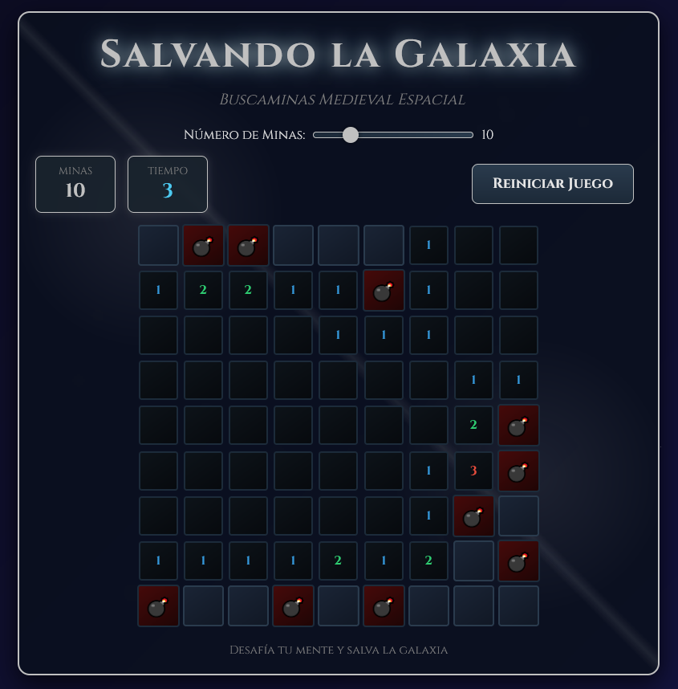

# 🌌 Salvando la Galaxia

**Salvando la Galaxia** es un juego estilo *Buscaminas Medieval Espacial* desarrollado con **HTML, CSS y JavaScript puro**.  
El objetivo es descubrir todas las casillas seguras del tablero sin activar ninguna mina, desafiando tu mente en un ambiente inmersivo con temática galáctica y estilo medieval.

## 🚀 Demo

## 📸 Captura de Pantalla

## 🎮 Características principales

- ⭐ Fondo animado con estrellas parpadeantes.
- ⚔️ Interfaz con diseño medieval-futurista.
- 💣 Minas distribuidas aleatoriamente en el tablero.
- ⏱️ Contador de tiempo en vivo.
- 🚩 Posibilidad de marcar casillas sospechosas con estandartes.
- 🎚️ Configuración del número de minas mediante un control deslizante.
- 📱 Compatible con **dispositivos móviles y escritorio** (soporta clicks, clicks derechos y long-press en pantalla táctil).
- 🏆 Pantallas de **victoria** y **derrota** con animaciones.

## 📂 Estructura del proyecto
### SalvandoLaGalaxia/
### │── index.html
### │── css/
### ├── └── style.css 
### │── js/
### ├── └── game.js
### ├── preview.png 
### └── README.md  

## 🛠️ Tecnologías utilizadas

- **HTML5** → Estructura del juego.  
- **CSS3** → Estilos, gradientes, sombras y animaciones.  
- **JavaScript** → Lógica del juego y detección de movimientos (mouse y touch). 

## 📝 Licencia
Este proyecto está bajo la **MIT License**.  
Libre para usar, modificar y compartir.  

## ⭐ ¿Te gustó el proyecto?
¡Dejá una ⭐ en GitHub y compartilo!  
Este juego combina **diseño atractivo y lógica desafiante** con un clásico actualizado.  

# ¡Gracias por jugar **Salvando la Galaxia**! 🎯✨ 